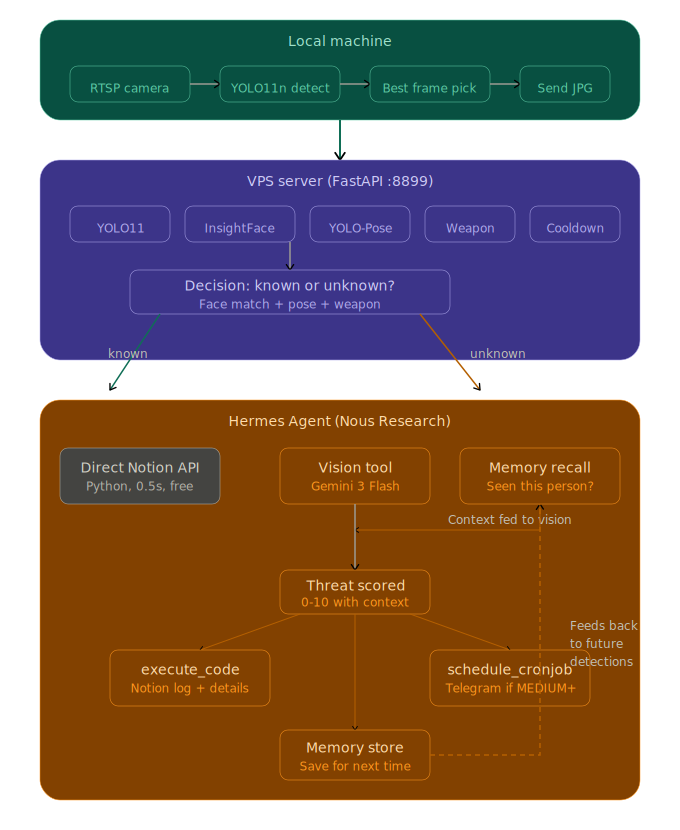

# AI Security Camera System

> Autonomous home security powered by YOLO, InsightFace, and [Hermes Agent](https://github.com/NousResearch/hermes-agent) — with real-time Telegram alerts and Notion logging.

[](https://python.org)
[](https://fastapi.tiangolo.com)
[](https://docs.ultralytics.com)
[](https://github.com/NousResearch/hermes-agent)
[](LICENSE)

---

## What It Does

Turn any IP camera into an intelligent security system that:

- **Detects people** in real-time using YOLO on your local machine
- **Recognizes faces** — distinguishes family from strangers using InsightFace
- **Analyzes threats** — AI vision agent examines suspicious detections
- **Alerts you instantly** — Telegram notifications with images for real threats
- **Logs everything** — full audit trail in Notion with images and metadata
- **Learns over time** — auto-adds frequent visitors to the known faces database

**Known person walks by?** → Logged to Notion in 0.5 seconds. Free. Silent.

**Stranger detected?** → AI vision analyzes the image → Notion log + Telegram alert with threat score.

---

## Architecture

<p align="center">
  
</p>

**Three layers:**

| Layer | Role | Key Components |
|---|---|---|
| **Local Machine** | Lightweight detection | RTSP camera → YOLO11n person detect → best frame picker → send JPG |
| **VPS Server** | ML pipeline + routing | YOLO11 + InsightFace + YOLO-Pose + Weapon → known/unknown decision |
| **Hermes Agent** | The brain | Vision (Gemini 3 Flash) + Memory + Threat scoring → Notion + Telegram |

Known persons route directly to Notion via Python (0.5s, free). Unknown/suspicious persons queue for async Hermes Agent vision analysis.

---

## Performance

| Detection Type | Path | Speed | Cost |
|---|---|---|---|
| Known person (clean) | Direct Python → Notion | **~0.5s** | Free |
| Unknown person | Async Hermes → Vision → Notion + Telegram | **~15-30s** | API call |
| Same person (60s cooldown) | Skipped | **0s** | Free |
| No person in frame | Early exit | **<0.1s** | Free |

~90% of detections hit the fast path (known persons). Only genuine threats invoke the AI agent.

---

## ML Pipeline

### Detection Models (loaded once, stay in RAM)

| Model | Purpose | Speed (CPU) |
|---|---|---|
| **YOLO11n** | Person & vehicle detection | ~200ms |
| **InsightFace (buffalo_l)** | Face recognition, age, gender | ~300ms |
| **YOLO11n-Pose** | Body pose (crouch, run, hide face) | ~150ms |
| **Weapon YOLO** | Gun/knife detection (optional) | ~150ms |

### Face Recognition Pipeline

```
Face detected → InsightFace 512-dim embedding
    │
    ├─ Match known_faces/ (cosine similarity > 0.4)
    │   ├─ Known + clean → save to known_object/ → Notion
    │   └─ Known + suspicious → Hermes vision analysis
    │
    └─ No match → Unknown tracker
        ├─ First time → Hermes vision + Telegram
        ├─ Repeat (2-4x) → Track, update embedding
        └─ Seen 5x → Auto-add to known_faces/
```

### Pose Analysis

Detects suspicious body language using YOLO-Pose keypoints:

| Behavior | Detection Method | Threat Points |
|---|---|---|
| Hiding face | Body visible, face keypoints missing | +4 |
| Crouching | Torso compressed < 35% body height | +3 |
| Running | Ankle spread > 60% body width | +2 |
| Bent over | Nose below hip level | +2 |
| Arms raised | Wrists above shoulders | +1 |

### Threat Scoring

| Level | Score | Triggers |
|---|---|---|
| NONE | 0 | Known person, delivery driver |
| LOW | 1-3 | Unknown, normal behavior |
| MEDIUM | 4-6 | Unknown + suspicious indicators |
| HIGH | 7-8 | Concealed face, suspicious approach |
| CRITICAL | 9-10 | Visible weapon, break-in attempt |

---

## Hermes Agent — The Brain

[**Hermes Agent**](https://github.com/NousResearch/hermes-agent) by [Nous Research](https://nousresearch.com) is the autonomous AI agent that turns raw ML detections into intelligent security decisions. It runs on the VPS alongside the ML pipeline and uses a custom skill following the [agentskills.io](https://agentskills.io) standard.

### Tools in Action

Hermes has 30+ built-in tools. Here's how our security system uses 4 of them:

#### 1. Vision Tool — Sees What's Actually Happening

Hermes views the actual camera image using **Gemini 3 Flash** and describes what it sees — not just bounding boxes, but context.

The same ML data can lead to completely different conclusions:

```
ML data: "Unknown person, crouching, no face visible"

Hermes @ 2pm: "Delivery driver bending down to place a package
               at the front door. DHL uniform visible. Score: 1 (LOW)"

Hermes @ 3am: "Unknown male in dark clothing crouching near front door.
               Face deliberately hidden from camera. Score: 8 (HIGH)"
```

The vision tool is what separates this from a basic alert system. ML detects pixels. Hermes understands scenes.

#### 2. Code Execution (`execute_code`) — Pushes to Notion

Hermes writes and runs Python on the fly to push structured data to Notion:

```python
# Hermes generates and executes this automatically
import requests
headers = {"Authorization": f"Bearer {NOTION_KEY}", ...}
payload = {
    "properties": {
        "Alert": {"title": [{"text": {"content": "MEDIUM — Front Door — 14:39"}}]},
        "Threat Level": {"select": {"name": "MEDIUM"}},
        "Score": {"number": 5},
        "Image": {"url": "http://vps-ip:8899/images/det_20260315.jpg"},
        ...
    }
}
requests.post("https://api.notion.com/v1/pages", headers=headers, json=payload)
```

No hardcoded Notion integration — Hermes reads the skill instructions and writes the API call itself.

#### 3. Telegram Alerts (`schedule_cronjob`) — Real-Time Notifications

For MEDIUM+ threats, Hermes schedules an alert to your Telegram with the image attached:

```
🟡 SECURITY ALERT: MEDIUM (Score: 5/10)

📷 Camera: Front Door
🕐 Time: 2026-03-15 14:39:36

📋 Summary: Unknown male, ~30y, lingering at front door

🔍 Observations:
• Weapons: No
• Face concealed: No
• Suspicious behavior: Yes

💡 Recommendation: Check live camera feed

📝 Logged to Notion ✓

MEDIA:/path/to/image.jpg
```

Hermes also runs a **daily security briefing** every morning at 8am — summarizing overnight detections, threat counts, and recommendations.

#### 4. Memory (`honcho_context`) — Pattern Awareness

Hermes maintains persistent memory across sessions. Every detection is remembered:

- "This unknown person was also seen Tuesday at 2am — same clothing"
- "Third delivery at this door today — probably the regular driver"
- "person_001 has been auto-added after 5 sightings, appears to be a neighbor"

Memory recall feeds **into** the vision tool — so when Hermes looks at an image, it already knows if this person has been seen before. This creates contextual awareness that no stateless ML model can match.

### Two-Path Routing (Speed Optimization)

```
Known person (clean)  → Direct Python → Notion (0.5s, free, no Hermes)
Unknown / suspicious  → Async Hermes queue → Vision + Notion + Telegram (background)
```

~90% of detections hit the fast path. Hermes is only invoked for genuine threats.

Learn more: [Hermes Agent GitHub](https://github.com/NousResearch/hermes-agent) · [Nous Research](https://nousresearch.com/hermes-agent/)

---

## Project Structure

```
ai-security-camera/
├── local/
│   └── local.py                 # Mac — YOLO detection + best frame + send
├── server/
│   └── server.py                # VPS — ML pipeline + Hermes + Notion
├── skills/
│   └── security-camera-analysis/
│       └── SKILL.md             # Hermes agent skill definition
├── docs/
│   └── architecture.svg         # System architecture diagram
├── requirements/
│   ├── local.txt                # Mac dependencies
│   └── server.txt               # VPS dependencies
├── README.md
├── LICENSE
└── .gitignore
```

---

## Quick Start

### Prerequisites

- **Camera**: Any RTSP-capable IP camera (tested: Dahua DH-P3D-3F-PV)
- **Local machine**: Mac/Linux with Python 3.10+
- **VPS**: 4+ CPU cores, 8GB RAM, Ubuntu 24.04
- **Accounts**: Notion API key, Telegram bot token

### 1. VPS Setup

```bash
ssh root@your-vps-ip

# Clone repo
git clone https://github.com/yourusername/ai-security-camera.git
cd ai-security-camera/server

# Create environment
python3 -m venv venv
source venv/bin/activate
pip install -r ../requirements/server.txt

# Add your faces
mkdir -p known_faces/your_name
# Copy 2-3 clear face photos into the folder

# Install Hermes Agent (for vision analysis)
# Follow: https://github.com/NousResearch/hermes-agent

# Configure
export NOTION_API_KEY="your_key"
export NOTION_DATABASE_ID="your_db_id"

# Run
python3 server.py
```

### 2. Local Setup (Mac)

```bash
cd ai-security-camera/local

pip install -r ../requirements/local.txt

# Edit RTSP_URL in .env to match your camera
export VPS_URL="http://your-vps-ip:8899"

python3 local.py
```

### 3. Notion Database

Create a database with these properties:

| Property | Type |
|---|---|
| Alert | Title |
| Threat Level | Select (NONE, LOW, MEDIUM, HIGH, CRITICAL) |
| Score | Number |
| Description | Rich Text |
| Camera | Rich Text |
| Image | URL |
| Time | Date |

---

## API Endpoints

| Endpoint | Method | Description |
|---|---|---|
| `/api/analyze` | POST | Submit image for analysis |
| `/health` | GET | Server status, model info, queue metrics |
| `/jobs/{job_id}` | GET | Check async Hermes job status |
| `/known` | GET | List known faces |
| `/unknowns` | GET | List tracked unknowns |
| `/logs` | GET | Recent analysis logs |
| `/images/{filename}` | GET | View uploaded images |

---

## Tech Stack

| Component | Technology |
|---|---|
| Object Detection | [YOLO11](https://docs.ultralytics.com) (Ultralytics) |
| Face Recognition | [InsightFace](https://github.com/deepinsight/insightface) (buffalo_l) |
| Pose Estimation | YOLO11-Pose |
| API Server | [FastAPI](https://fastapi.tiangolo.com) + Uvicorn |
| AI Agent | [Hermes Agent](https://github.com/NousResearch/hermes-agent) by Nous Research |
| Vision Model | Gemini 3 Flash (via Nous Portal) |
| Logic Model | DeepSeek v3.2 (via Nous Portal) |
| Logging | [Notion API](https://developers.notion.com) |
| Alerting | Telegram Bot (via Hermes Gateway) |
| Camera Protocol | RTSP |
| Skill Standard | [agentskills.io](https://agentskills.io) |

---

## License

MIT License — see [LICENSE](LICENSE) for details.

---

## Acknowledgments

- [**Nous Research**](https://nousresearch.com) — Hermes Agent framework, Nous Portal inference API
- [**Hermes Agent**](https://github.com/NousResearch/hermes-agent) — Self-improving AI agent with vision, memory, skills, and multi-platform messaging
- [Ultralytics YOLO](https://github.com/ultralytics/ultralytics) — Object detection and pose estimation
- [InsightFace](https://github.com/deepinsight/insightface) — Face recognition and analysis
- [FastAPI](https://fastapi.tiangolo.com) — High-performance API framework
- [Notion API](https://developers.notion.com) — Structured logging backend
